---
title: "421 Midterm Presentation"
output:
  xaringan::moon_reader:
    lib_dir: libs
    nature:
      highlightStyle: github
      highlightLines: true
      countIncrementalSlides: false
   

---
# Plot 1

```{r setup, include=FALSE}
options(htmltools.dir.version = FALSE)
```

```{r xaringan-tile-view, echo=FALSE}
xaringanExtra::use_tile_view()
```


```{r xaringan-panelset, echo=FALSE}
xaringanExtra::use_panelset()
```

```{r, echo=FALSE}
xaringanExtra::use_webcam()
```

```{r xaringan-fit-screen, echo=FALSE}
xaringanExtra::use_fit_screen()
```

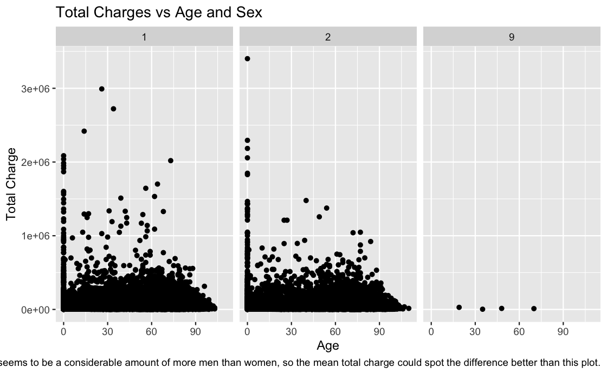

---
# Plot 2

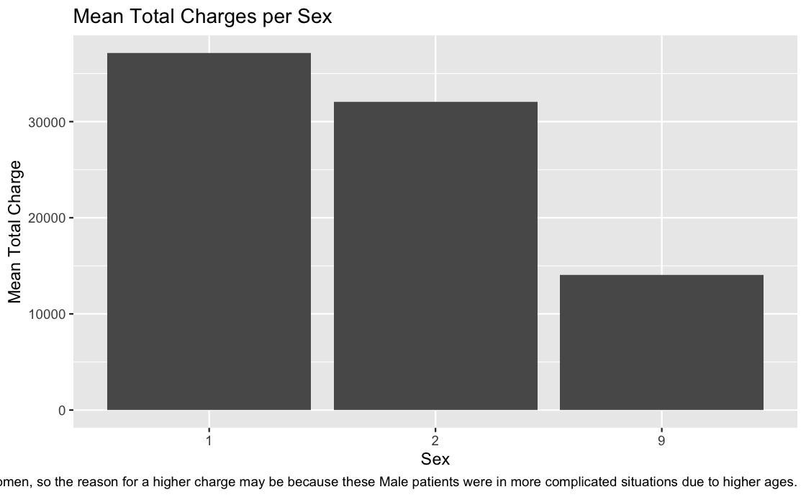

---

# Plot 3

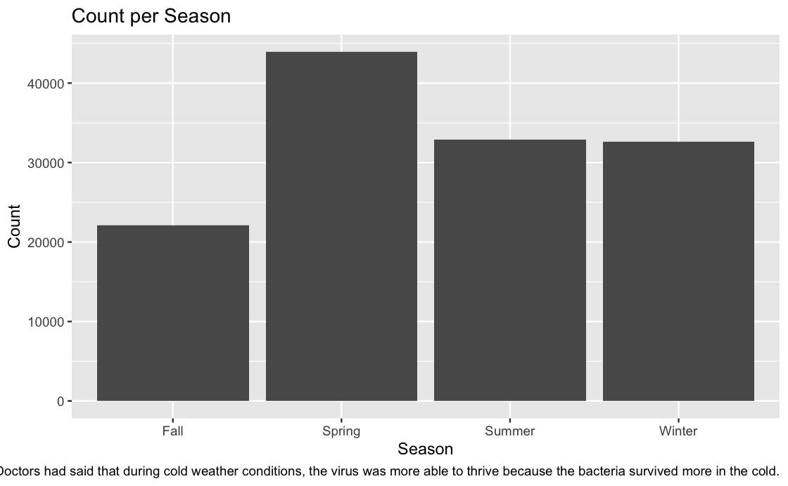

---
# Plot 4

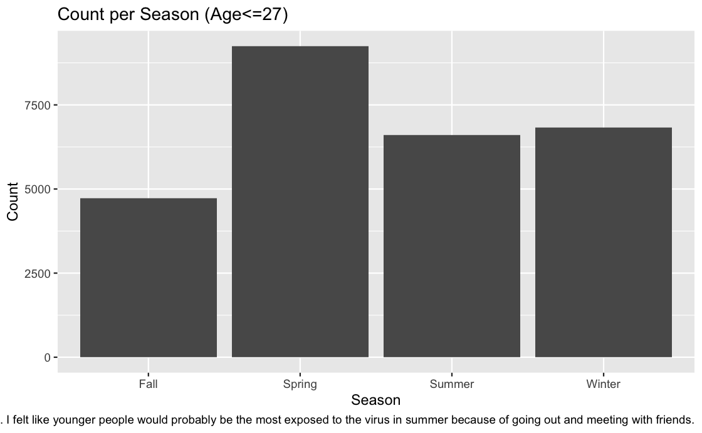

---
# Plot 5

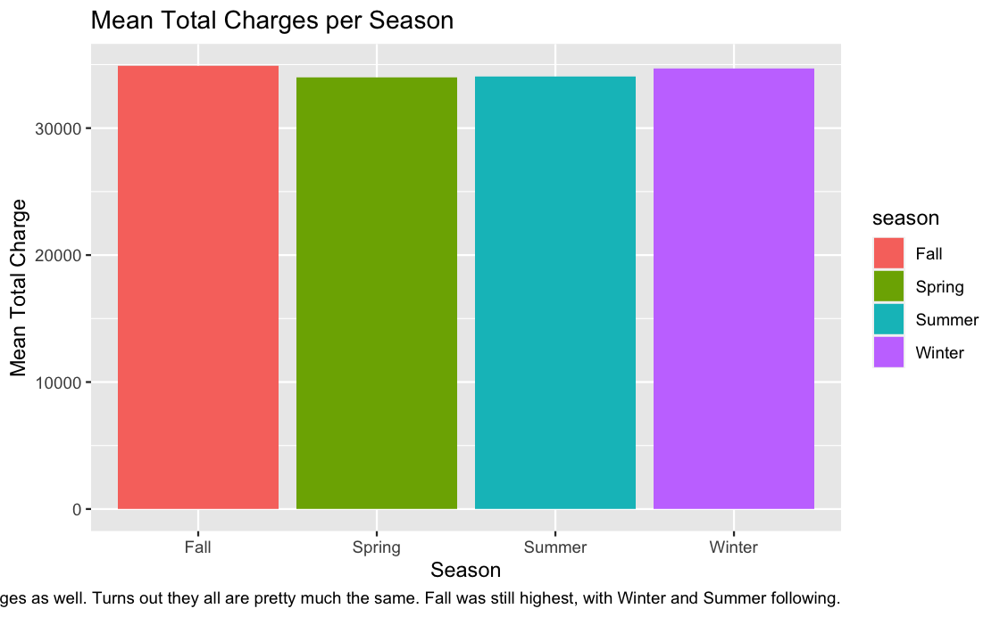

---
# Plot 6

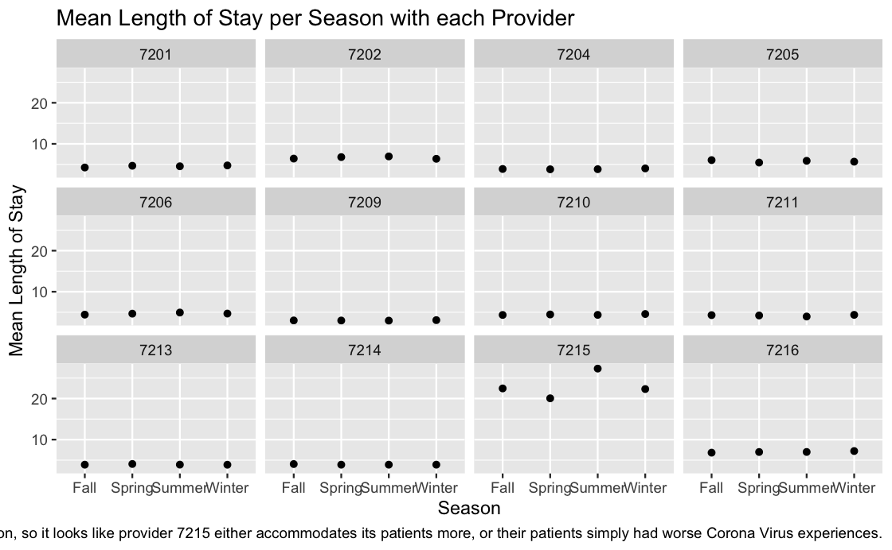

---
# Plot 7

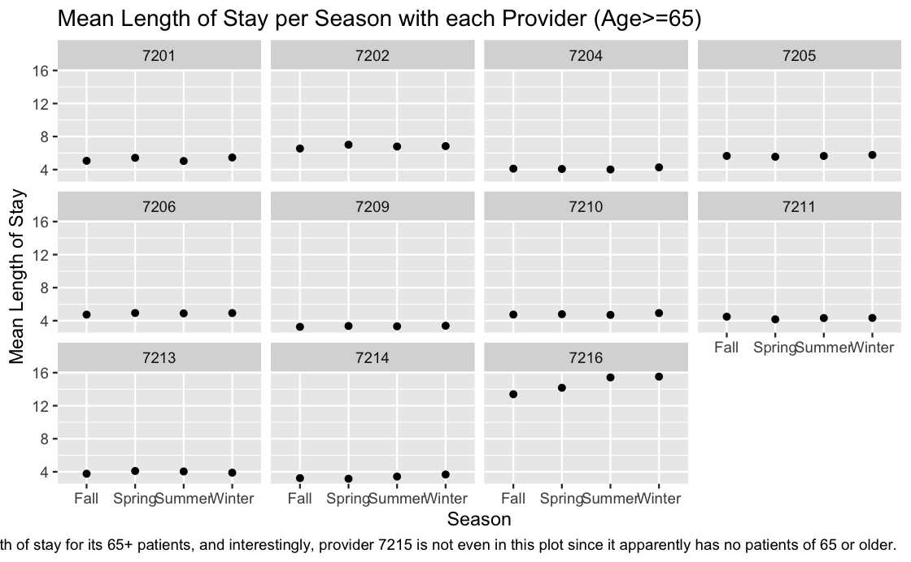

---
# Plot 8

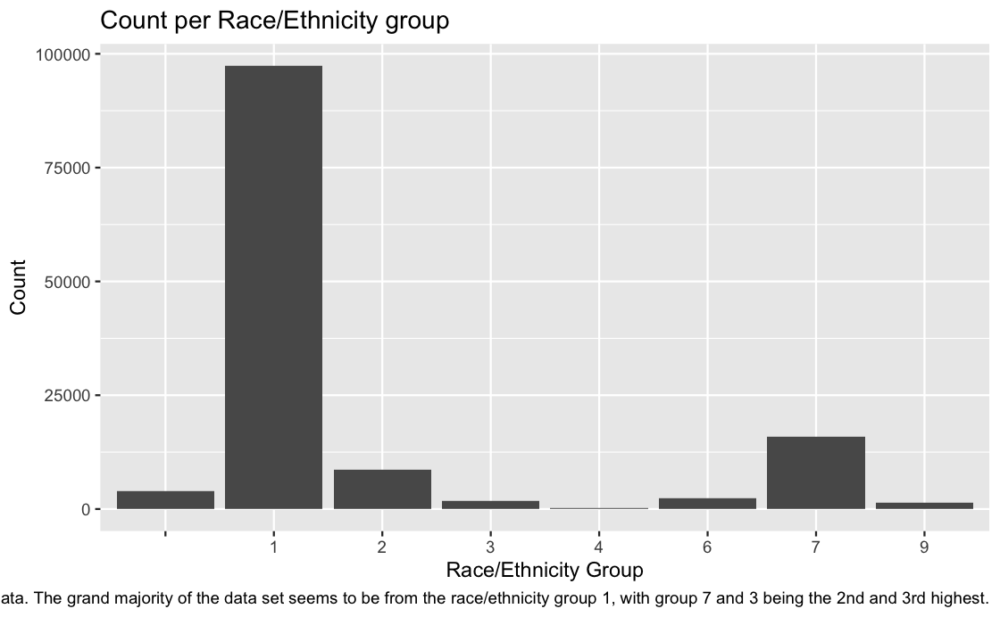

---
# Plot 9

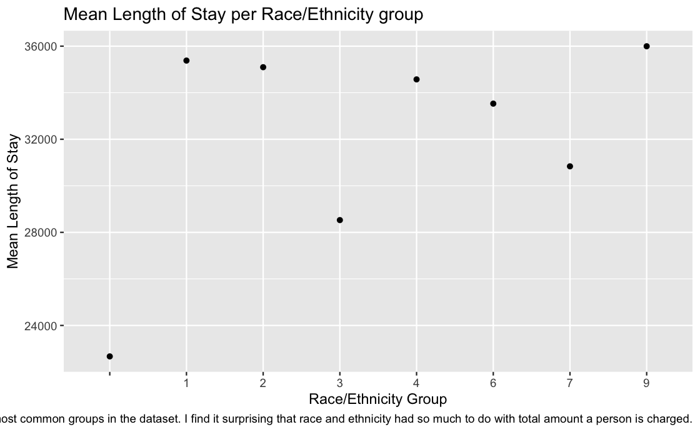

---
# Plot 10

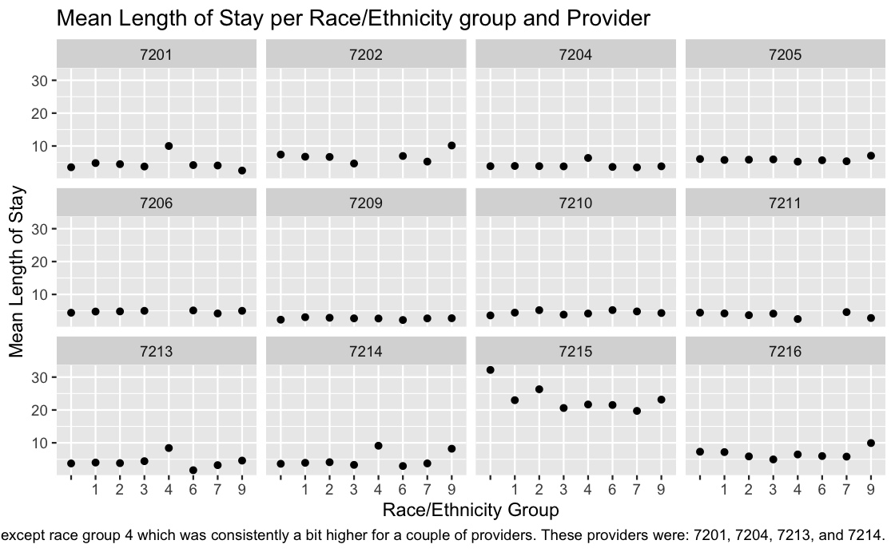

---
# Model Comparison

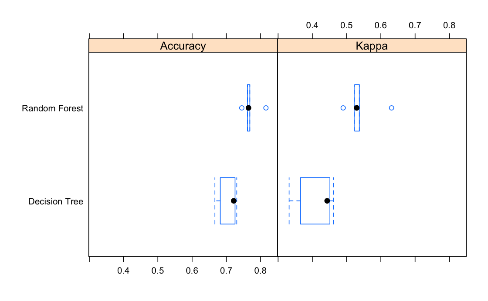

 Accuracy 
0.7810314 
---
# Part 6

- Target Variable: Length of Stay
- Target_los = 'Low' when los < mean, 'High' when los > mean

---
# Tree Model (rpart2)

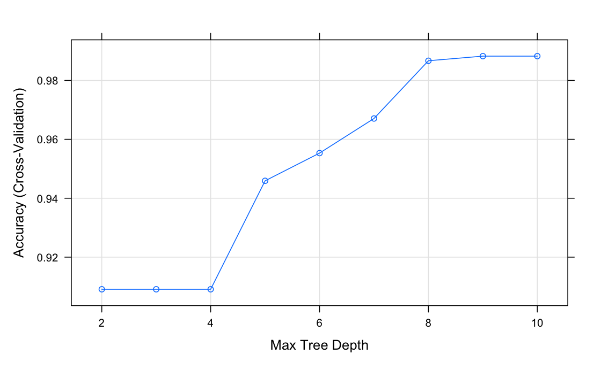

---
# Forest Model (ranger)

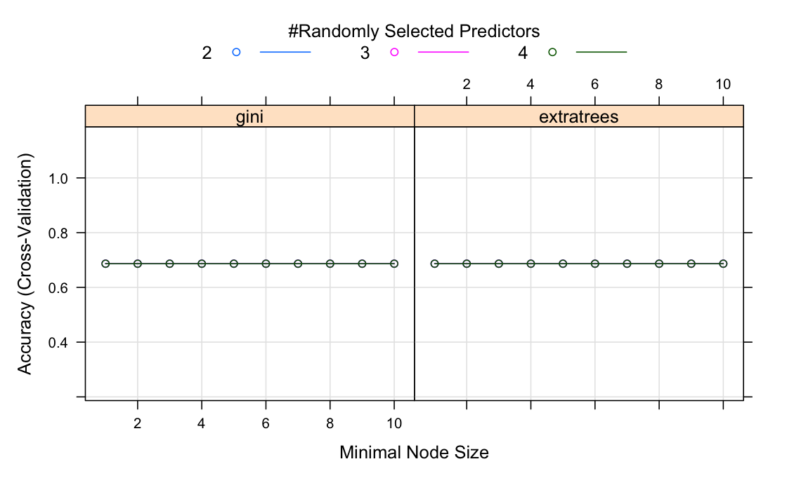

---
# Accuracy Comparison

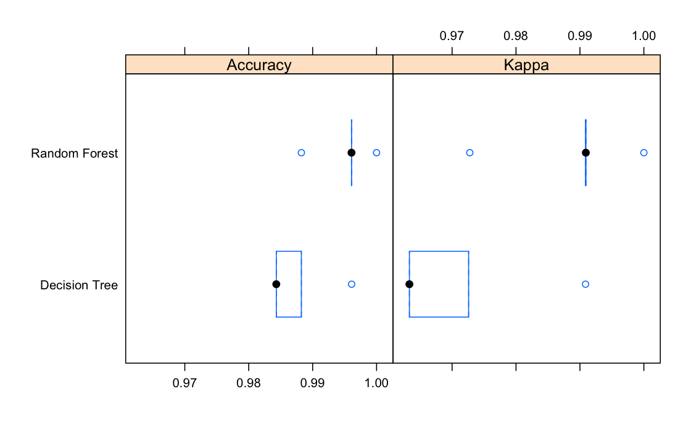

 Accuracy 
0.9967763 

---
# Challenges

- Loading the dataset

- Interpreting some variables in the dataset because there were too many